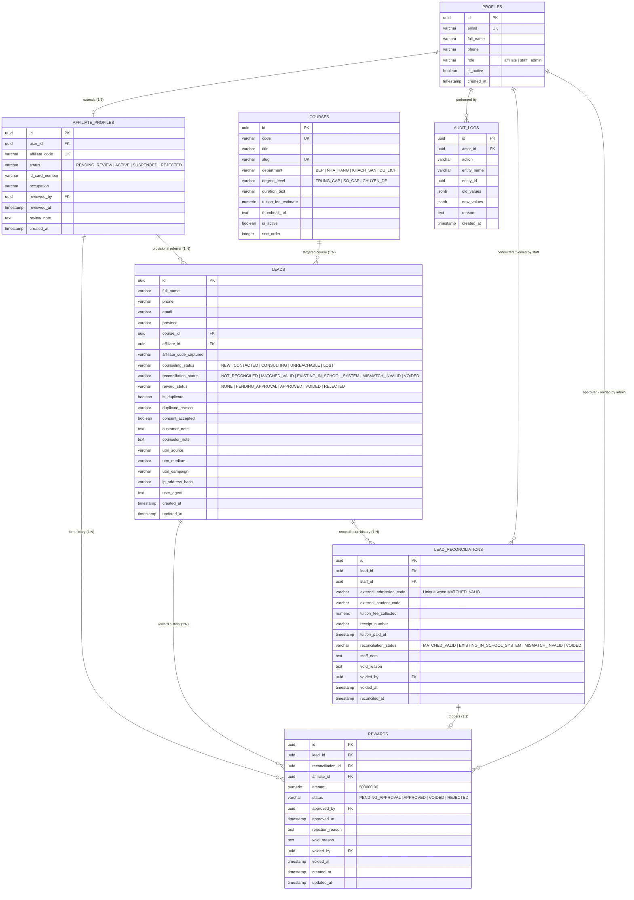

# TÀI LIỆU THIẾT KẾ KIẾN TRÚC & HỆ THỐNG WEB CỘNG TÁC VIÊN TUYỂN SINH
## TRƯỜNG TRUNG CẤP DU LỊCH & KHÁCH SẠN SAIGONTOURIST (STHC)

- **Mã tài liệu:** `STHC-AFF-DESIGN-V1.1-REV2`  
- **Phiên bản:** `v1.1 (Hoàn thiện kiến trúc Backend API Gateway bảo vệ dữ liệu PII, loại bỏ mâu thuẫn PostgREST View, mô hình bảo lưu lịch sử thưởng, và rà soát đề xuất chờ trường chốt)`  
- **Ngày cập nhật:** 29/09/2026  
- **Kiến trúc công nghệ mục tiêu:** React SPA (Vite / Tailwind CSS), Backend API Server (Node.js/Express hoặc Edge Functions), CSDL Supabase PostgreSQL riêng biệt, Supabase Auth, Supabase Storage.  
- **Cam kết môi trường:** Độc lập hoàn toàn, không can thiệp, không kết nối trực tiếp và không thay đổi CSDL tuyển sinh chính thức hay Supabase production sẵn có của nhà trường. Chưa viết mã nguồn ứng dụng và chưa chạy migration CSDL.

---

## 1. TỔNG QUAN HỆ THỐNG & NGUYÊN TẮC THIẾT KẾ CỐT LÕI (V1.1)

### 1.1. Phạm vi cốt lõi Giai đoạn 1 (Phase 1 Scope Boundary)
1. **Phạm vi hoàn tất tại Giai đoạn 1:**
   - Đăng ký và xét duyệt tài khoản Cộng tác viên (CTV).
   - Cung cấp liên kết tiếp thị (`referral_url`) và mã QR định danh riêng theo từng ngành đào tạo cho CTV đã duyệt.
   - Form công khai thu thập thông tin tư vấn do ứng viên tự điền, xác thực và lưu vết nguồn gốc.
   - Giao diện đối soát thủ công dành cho Cán bộ Tuyển sinh: đối chiếu ứng viên với hồ sơ giấy/phần mềm tuyển sinh nội bộ của trường, xác nhận học phí thực tế.
   - Phê duyệt khoản thưởng cố định **500.000 VNĐ / hồ sơ nhập học hợp lệ** bởi Trưởng bộ phận Tuyển sinh / Admin.
   - Xuất bảng kê danh sách thưởng (Excel/CSV) để chuyển giao cho Phòng Tài chính - Kế toán thực hiện chi trả thủ công ngoài hệ thống.
2. **Loại trừ tuyệt đối khỏi Giai đoạn 1 (Strict Exclusions):**
   - **Không xây dựng ví điện tử, số dư ảo, yêu cầu rút tiền trực tuyến, hay thông tin tài khoản ngân hàng của CTV.**
   - **Loại bỏ toàn bộ các thao tác đánh dấu đã chi (`mark_as_paid`), tạo đợt chi trả (`payout_batch`), quản lý chứng từ phiếu chi kế toán** khỏi màn hình, API và cơ sở dữ liệu. Toàn bộ nghiệp vụ thanh toán thù lao do Phòng Tài chính - Kế toán xử lý ngoại tuyến theo quy chế hiện hành của Trường.

### 1.2. Nguyên tắc tạo Lead & Ghi nhận nguồn CTV
1. **Khách hàng tự đăng ký (Prospect-initiated Registration Only):**
   - CTV **chỉ đóng vai trò chia sẻ link và mã QR**. CTV tuyệt đối **không có quyền tạo trước lead hoặc nhập thông tin ứng viên thay cho khách** vào hệ thống (ngăn ngừa triệt để nạn gom danh bạ, tạo lead rác hoặc gian lận).
   - Form tư vấn trên trang công khai **không yêu cầu số CCCD của người học** (chỉ thu thập: Họ tên, Số điện thoại, Email [tùy chọn], Tỉnh/Thành phố, Ngành học quan tâm, Khung giờ tiện liên hệ và Ghi chú).
   - Bắt buộc có điều khoản đồng ý (Consent Checkbox): *"Tôi đồng ý để Trường Trung cấp Du lịch & Khách sạn Saigontourist liên hệ tư vấn tuyển sinh và xử lý thông tin theo Chính sách bảo vệ dữ liệu cá nhân của Trường"*.
2. **Quy tắc ghi nhận nguồn (Attribution Policy):**
   - **Lượt gửi form hợp lệ đầu tiên sẽ giữ nguồn CTV tạm thời.**
   - **Đăng ký lại không tự chuyển nguồn:** Nếu cùng một số điện thoại gửi lại form tư vấn trong khoảng thời gian bảo hộ (90 ngày), hệ thống ghi nhận lịch sử quan tâm mới nhưng **không tự động thay đổi nguồn CTV ban đầu sang CTV khác** (ngăn chặn tình trạng cướp lead vào phút chót).
3. **Quy tắc duyệt CTV (Affiliate Approval Gate):**
   - Chỉ CTV có trạng thái **`ACTIVE` (Đã được duyệt và đang hoạt động)** mới được cấp link/QR hợp lệ và được ghi nhận lead.
   - Nếu CTV đang ở trạng thái `PENDING_REVIEW` (Chờ duyệt), `REJECTED` (Từ chối) hoặc `SUSPENDED` (Tạm ngưng), mã giới thiệu sẽ không được hệ thống ghi nhận thưởng khi có form gửi về.

### 1.3. Bản chất nguồn xác nhận học phí & Đối soát thủ công
- CSDL tuyển sinh chính thức của Trường Saigontourist nằm trên hệ thống quản lý đào tạo/tuyển sinh riêng và chưa có API đồng bộ.
- Dữ liệu học phí và nhập học trên Hệ thống CTV **không phải là dữ liệu tự động đồng bộ từ phòng kế toán**, mà là **kết quả của thao tác đối soát thủ công (Manual Verification)** do Cán bộ Tuyển sinh thực hiện dựa trên bằng chứng kiểm tra thực tế (số phiếu thu, biên lai học phí, mã hồ sơ nhập học gốc tại trường).
- Mỗi thao tác đối soát và phê duyệt thưởng phải thể hiện rõ:
  - **Người nhập đối soát (`staff_id` / `reconciled_by`)**.
  - **Bằng chứng kiểm tra (`external_admission_code`, `receipt_number`, `tuition_fee_collected`, `tuition_paid_at`)**.
  - **Người duyệt thưởng (`approved_by`)**.

---

## 2. LUỒNG NGHIỆP VỤ HỆ THỐNG & XỬ LÝ TRANH CHẤP (V1.1)

```
[1. CTV Đăng ký tài khoản] ──► Trạng thái: PENDING_REVIEW
                                      │
                                      ▼ (Phòng Tuyển sinh kiểm tra & duyệt)
[2. Kích hoạt tài khoản CTV] ─► Trạng thái: ACTIVE (Cấp Mã CTV, Link & QR hợp lệ)
                                      │
                                      ▼ (CTV chia sẻ Link/QR ngành học đến học viên)
[3. Học viên quét QR/bấm Link]► Truy cập Trang thông tin khóa học (Lưu cookie ref 30 ngày)
                                      │
                                      ▼
[4. Học viên tự điền Form] ───► Điền Họ tên, SĐT, Email, Tỉnh thành, Ngành học, Tích chọn Đồng ý
                                      │
                                      ▼ (Server kiểm tra Chống spam + Chống trùng 90 ngày)
[5. Tiếp nhận Lead] ──────────► Tạo bản ghi Lead:
                                 - Trạng thái tư vấn: NEW
                                 - Trạng thái đối soát: NOT_RECONCILED
                                 - Trạng thái thưởng: NONE
                                      │
                                      ▼
[6. Cán bộ gọi điện tư vấn] ──► Cập nhật trạng thái tư vấn: CONTACTED ──► CONSULTING
                                      │
                                      ▼ (Học viên nộp hồ sơ & đóng học phí thực tế tại STHC)
[7. Đối soát thủ công] ───────► Cán bộ Tuyển sinh tra cứu Lead trên Cổng CTV:
                                 - Kiểm tra đối chiếu với phần mềm tuyển sinh của trường
                                 - Nhập: Mã hồ sơ ngoài, Số phiếu thu, Học phí thực thu
                                 - Kiểm tra ràng buộc duy nhất của Mã hồ sơ ngoại bộ
                                 - Cập nhật Trạng thái đối soát: MATCHED_VALID
                                      │
                                      ▼ (Tự động sinh bản ghi Thưởng 500.000 VNĐ)
[8. Kích hoạt Thưởng] ────────► Trạng thái thưởng: PENDING_APPROVAL
                                      │
                                      ▼
[9. Phê duyệt Thưởng] ────────► Trưởng phòng Tuyển sinh / Admin kiểm tra bằng chứng:
                                 - Duyệt: Trạng thái thưởng -> APPROVED
                                 - Hoặc Từ chối: -> REJECTED (Bắt buộc nhập lý do)
                                      │
                                      ▼
[10. Xuất bảng kê cho Kế toán]► Admin xuất file Excel danh sách thưởng APPROVED theo đợt
                                 để chuyển Phòng Kế toán thực hiện chi trả thủ công ngoài hệ thống
```

### 2.1. Kịch bản A: Khách hàng đã tồn tại trong hệ thống tuyển sinh của trường trước đó
- **Tình huống:** Học viên A đã đến nộp hồ sơ hoặc ghi danh trực tiếp tại Văn phòng tuyển sinh Trường Saigontourist. Sau đó mới phát sinh lượt điền form qua link của một CTV.
- **Quy trình xử lý:**
  1. Khi đối soát, Cán bộ Tuyển sinh tra cứu mã hồ sơ trên hệ thống trường và phát hiện ngày ghi danh trực tiếp tại trường diễn ra **trước ngày tạo lead trên Cổng CTV**.
  2. Cán bộ ghi nhận kết quả đối soát: **`EXISTING_IN_SCHOOL_SYSTEM` (Đã tồn tại trong hệ thống trường trước thời điểm giới thiệu)**.
  3. Hệ thống tự động ghi nhật ký kiểm toán (`audit_logs`) nêu rõ mã cán bộ xử lý, mã hồ sơ trường, thời điểm đối soát, lý do từ chối.
  4. Trạng thái thưởng của Lead giữ nguyên là `NONE`. CTV theo dõi trên bảng kê sẽ thấy trạng thái minh bạch: *"Học viên đã nộp hồ sơ tại trường trước ngày giới thiệu"*, triệt tiêu tranh chấp.

### 2.2. Kịch bản B: Khóa chống trùng mã hồ sơ & Quy trình sửa ghép nhầm (Bảo toàn lịch sử cả khi đã duyệt thưởng)
- **Yêu cầu kỹ thuật cốt lõi:**
  - Một Mã hồ sơ tuyển sinh ngoại bộ (`external_admission_code`) **chỉ được gắn với tối đa 01 khoản thưởng hợp lệ** tại bất kỳ thời điểm nào.
  - Khi Cán bộ nhập nhầm mã hồ sơ hoặc ghép nhầm Lead (kể cả khi khoản thưởng đã được Trưởng phòng duyệt `APPROVED`), hệ thống **phải cho phép hủy ghép nhầm và đối soát lại chính xác trên cùng một lead đó mà không làm mất lịch sử kiểm toán trước đó**.
- **Cơ chế lưu vết lịch sử (Audit-Proof History Pattern):**
  1. **Tách quan hệ 1:N cho lịch sử:** Một Lead có thể có nhiều bản ghi đối soát (`lead_reconciliations`) và nhiều bản ghi thưởng (`rewards`) theo dòng thời gian (mỗi bản ghi đại diện cho một lần thẩm định).
  2. **Ràng buộc duy nhất có điều kiện (Partial Unique Indexes):**
     ```sql
     -- Đảm bảo 1 mã hồ sơ trường chỉ được duyệt cho 1 bản ghi đối soát hợp lệ:
     CREATE UNIQUE INDEX uq_valid_admission_code 
     ON public.lead_reconciliations (external_admission_code) 
     WHERE reconciliation_status = 'MATCHED_VALID';

     -- Đảm bảo 1 lead chỉ có tối đa 1 khoản thưởng đang hoạt động (PENDING hoặc APPROVED):
     CREATE UNIQUE INDEX uq_active_reward_per_lead 
     ON public.rewards (lead_id) 
     WHERE status IN ('PENDING_APPROVAL', 'APPROVED');
     ```
  3. **Quy trình hủy ghép nhầm (Void / Unlink Workflow):**
     - Cán bộ / Admin bấm nút **"Hủy ghép đối soát do sai sót (Void Reconciliation)"**.
     - Bắt buộc nhập lý do hủy (ví dụ: *"Nhập nhầm mã sinh viên từ 26DL0188 thành 26DL0189 của lớp khác"*).
     - Hệ thống thực thi một Database Transaction an toàn:
       - Bản ghi `lead_reconciliations` hiện tại chuyển `reconciliation_status = 'VOIDED'`, lưu `void_reason`, `voided_by`, `voided_at`.
       - Bản ghi `rewards` liên kết (kể cả đã ở trạng thái `APPROVED`) được chuyển sang `status = 'VOIDED'`, lưu `void_reason`, `voided_by`, `voided_at`. **Bản ghi này KHÔNG bị xóa mà được giữ nguyên trong cơ sở dữ liệu làm bằng chứng kiểm toán**.
       - Bản ghi `leads` được cập nhật lại: `reconciliation_status = 'NOT_RECONCILED'`, `reward_status = 'NONE'`.
       - Ghi toàn bộ dữ liệu cũ và mới vào `audit_logs` với action `'VOID_RECONCILIATION'`.
     - Mã hồ sơ tuyển sinh ngoại bộ cũ được giải phóng khỏi ràng buộc `uq_valid_admission_code`.
  4. **Quy trình đối soát lại cho cùng Lead đó:**
     - Cán bộ nhập mã hồ sơ chính xác cho chính Lead đó.
     - Hệ thống tạo một bản ghi `lead_reconciliations` mới (`reconciliation_status = 'MATCHED_VALID'`).
     - Tự động sinh một bản ghi `rewards` mới (`status = 'PENDING_APPROVAL'`) liên kết với bản ghi đối soát mới.
     - Trưởng phòng kiểm tra và phê duyệt bản ghi thưởng mới.
     - Lịch sử đầy đủ gồm 2 bản ghi thưởng (Bản ghi 1: `VOIDED`, Bản ghi 2: `APPROVED`) được lưu trữ trọn vẹn, minh bạch 100%.

---

## 3. TÁCH BIỆT 3 TRỤC TRẠNG THÁI NGHIỆP VỤ (THREE INDEPENDENT LIFECYCLES)

Hệ thống tách biệt độc lập 3 trục trạng thái trên mỗi bản ghi Lead, giải quyết triệt để sự xung đột logic giữa khâu tư vấn, khâu đối soát và khâu duyệt thưởng:

```
[BẢN GHI LEAD]
  ├── (1) counseling_status      : Quá trình tiếp cận của Cán bộ Tư vấn
  ├── (2) reconciliation_status  : Kết quả đối chiếu với hồ sơ & học phí thực tế của Trường
  └── (3) reward_status          : Trạng thái phê duyệt thù lao 500.000 VNĐ
```

### 3.1. Trục 1: Trạng thái Tư vấn (`counseling_status`)
| Mã trạng thái | Tên hiển thị | Ý nghĩa nghiệp vụ |
|---|---|---|
| `NEW` | Mới tiếp nhận | Lead vừa gửi form thành công qua link của CTV hợp lệ. |
| `CONTACTED` | Đã liên hệ | Cán bộ đã gọi điện hoặc nhắn tin tư vấn lần đầu. |
| `CONSULTING` | Đang tư vấn | Đang gửi tài liệu, giải đáp học phí, hẹn lịch tham quan trường. |
| `UNREACHABLE` | Không liên lạc được | Thuê bao, không bắt máy sau tối thiểu 3 lần liên hệ vào các ca khác nhau. |
| `LOST` | Hết nhu cầu / Hủy | Người học từ chối nhập học hoặc chuyển hướng ngành nghề khác. |

### 3.2. Trục 2: Kết quả Đối soát Hồ sơ (`reconciliation_status`)
| Mã trạng thái | Tên hiển thị | Ý nghĩa nghiệp vụ |
|---|---|---|
| `NOT_RECONCILED` | Chưa đối soát | Mặc định ban đầu, chưa tiến hành đối chiếu với hồ sơ trường. |
| `MATCHED_VALID` | Khớp hợp lệ | Đã xác minh trùng khớp: thí sinh nộp hồ sơ chính thức và đã nộp đủ học phí đợt đầu. |
| `EXISTING_IN_SCHOOL_SYSTEM` | Đã có trên hệ thống trường | Thí sinh đã nộp hồ sơ trực tiếp tại trường trước ngày tạo lead trên Cổng CTV. |
| `MISMATCH_INVALID` | Không khớp hồ sơ | SĐT hoặc thông tin không trùng khớp với hồ sơ tuyển sinh nào của trường. |
| `VOIDED` | Đã hủy đối soát | Bản ghi đối soát từng được lập nhưng bị hủy bỏ do phát hiện nhầm lẫn mã hồ sơ. |

### 3.3. Trục 3: Trạng thái Thưởng (`reward_status`)
| Mã trạng thái | Tên hiển thị | Ý nghĩa nghiệp vụ |
|---|---|---|
| `NONE` | Chưa phát sinh | Lead chưa đủ điều kiện đối soát hoặc không đủ tiêu chuẩn nhận thưởng. |
| `PENDING_APPROVAL` | Chờ duyệt thưởng | Hồ sơ đã được đối soát `MATCHED_VALID`, hệ thống khởi tạo khoản thưởng 500.000 VNĐ. |
| `APPROVED` | Đã duyệt thưởng | Trưởng phòng Tuyển sinh / Admin đã kiểm tra bằng chứng và phê duyệt hợp lệ. |
| `VOIDED` | Đã hủy thưởng | Khoản thưởng (kể cả đã Approved) bị hủy do hủy ghép nối đối soát sai sót. |
| `REJECTED` | Từ chối duyệt | Lãnh đạo từ chối duyệt thưởng kèm theo lý do bắt buộc. |

---

## 4. KIẾN TRÚC BẢO VỆ DỮ LIỆU PII: MÔ HÌNH BACKEND API GATEWAY & PHÂN QUYỀN SUPABASE

### 4.1. Phân tích lỗi kiến trúc cũ & Giải pháp chuẩn hóa
* **Mâu thuẫn kiến trúc cũ:**
  - Nếu thực hiện `REVOKE SELECT ON leads FROM authenticated`, thì view có `security_invoker = on` chạy dưới quyền của `authenticated` (CTV) sẽ lập tức bị PostgreSQL trả về lỗi `42501 permission denied for table leads` do role không có quyền đọc bảng nguồn `leads`.
  - Ngược lại, nếu thực hiện `GRANT SELECT ON leads TO authenticated` (kể cả khi đã cấu hình Row Level Security), PostgREST của Supabase sẽ tự động phơi bày endpoint `/rest/v1/leads`. Người dùng am hiểu kỹ thuật có thể mở DevTools / Postman gọi trực tiếp vào bảng gốc và đọc được toàn bộ các trường nhạy cảm như `email`, `counselor_note` (ghi chú nội bộ), và số điện thoại gốc chưa che mờ.
* **Giải pháp chuẩn hóa (Backend API Gateway Pattern / Trusted Server Proxy):**
  - **Mọi truy vấn dữ liệu Lead của Cộng tác viên BẮT BUỘC PHẢI ĐI QUA BACKEND API (`GET /api/v1/affiliate/leads`).**
  - Frontend Cổng CTV **hoàn toàn không được giao tiếp trực tiếp với Supabase PostgREST** để đọc bảng `leads`, `lead_reconciliations` hay `rewards`.
  - **Phân tách khóa bí mật nghiêm ngặt:**
    - `SUPABASE_ANON_KEY`: Khóa công khai, chỉ dùng ở frontend cho tác vụ xác thực người dùng (Supabase Auth: Sign In, Sign Out, Session token).
    - `SUPABASE_SERVICE_ROLE_KEY`: Khóa quản trị máy chủ, **CHỈ ĐƯỢC LƯU TRỮ TRONG BIẾN MÔI TRƯỜNG PHÍA SERVER BACKEND (`.env.server`)**. Tuyệt đối không bao giờ được đóng gói vào client bundle và không bao giờ xuất hiện ở frontend.

### 4.2. Ma trận quyền truy cập bảng của các vai trò trong Supabase

| Bảng dữ liệu | Vai trò `anon` (Khách) | Vai trò `authenticated` (CTV đăng nhập) | Vai trò `service_role` (Backend Server) | Ghi chú an toàn |
|---|:---:|:---:|:---:|---|
| **`leads`** | ❌ Chặn toàn bộ | ❌ **`REVOKE ALL` (Không có quyền SELECT)** | ✅ Toàn quyền nội bộ | CTV gọi `/rest/v1/leads` sẽ bị trả về `403 Forbidden`. |
| **`lead_reconciliations`**| ❌ Chặn toàn bộ | ❌ **`REVOKE ALL` (Không có quyền SELECT)** | ✅ Toàn quyền nội bộ | Bảo vệ tuyệt đối thông tin học phí và mã hồ sơ trường. |
| **`rewards`** | ❌ Chặn toàn bộ | ❌ **`REVOKE ALL` (Không có quyền SELECT)** | ✅ Toàn quyền nội bộ | Dữ liệu thưởng CTV được Backend API thẩm định trước khi trả về. |
| **`affiliate_profiles`** | ❌ Chặn toàn bộ | 🔍 `SELECT` cá nhân (`user_id = auth.uid()`) | ✅ Toàn quyền nội bộ | CTV chỉ xem được thông tin hồ sơ của chính mình. |
| **`profiles`** | ❌ Chặn toàn bộ | 🔍 `SELECT, UPDATE` cá nhân (`id = auth.uid()`) | ✅ Toàn quyền nội bộ | Quản lý thông tin tài khoản cá nhân. |
| **`courses`** | 🔍 `SELECT` (Public) | 🔍 `SELECT` (Public) | ✅ Toàn quyền nội bộ | Danh mục khóa học tuyển sinh công khai. |

### 4.3. SQL DDL Phân quyền Database trên Supabase

```sql
-- ==============================================================================
-- 1. THU HỒI TOÀN BỘ QUYỀN TRÊN BẢNG LEADS ĐỐI VỚI ANON VÀ AUTHENTICATED
-- ==============================================================================
REVOKE ALL ON TABLE public.leads FROM anon, authenticated;
REVOKE ALL ON TABLE public.lead_reconciliations FROM anon, authenticated;
REVOKE ALL ON TABLE public.rewards FROM anon, authenticated;

-- ==============================================================================
-- 2. BẬT ROW LEVEL SECURITY (RLS) PHÒNG THỦ ĐA TẦNG
-- ==============================================================================
ALTER TABLE public.leads ENABLE ROW LEVEL SECURITY;
ALTER TABLE public.lead_reconciliations ENABLE ROW LEVEL SECURITY;
ALTER TABLE public.rewards ENABLE ROW LEVEL SECURITY;
ALTER TABLE public.affiliate_profiles ENABLE ROW LEVEL SECURITY;
ALTER TABLE public.profiles ENABLE ROW LEVEL SECURITY;

-- 2.1. Policy cho bảng affiliate_profiles: CTV chỉ đọc hồ sơ của chính mình
CREATE POLICY "Affiliates can view own profile"
ON public.affiliate_profiles
FOR SELECT
TO authenticated
USING (user_id = auth.uid());

-- 2.2. Policy cho bảng profiles: Người dùng chỉ xem/sửa hồ sơ của mình
CREATE POLICY "Users can manage own profile"
ON public.profiles
FOR ALL
TO authenticated
USING (id = auth.uid());

-- 2.3. Cấp quyền truy cập cho service_role (Mặc định trong Supabase bypass RLS,
--      nhưng cấp quyền rõ ràng để đảm bảo tương thích mọi runtime PostgreSQL):
GRANT ALL ON ALL TABLES IN SCHEMA public TO service_role;
```

### 4.4. Cơ chế kiểm tra quyền và Chiếu dữ liệu an toàn của Backend API
Khi Frontend Cổng CTV gửi yêu cầu lấy danh sách lead:
```
[Frontend Cổng CTV]
        │
        │ 1. GET /api/v1/affiliate/leads (Header: Authorization: Bearer <Supabase_JWT>)
        ▼
[Backend API Server]
        │
        ├─► 2. Giải mã và kiểm tra tính hợp lệ của Supabase JWT qua `supabaseAuth.getUser(jwt)`.
        │      Nếu token không hợp lệ hoặc hết hạn ➔ Trả về HTTP 401 Unauthorized.
        │
        ├─► 3. Trích xuất `auth_uid` từ JWT đã xác thực.
        │
        ├─► 4. Tra cứu bảng `affiliate_profiles` WHERE `user_id = auth_uid`:
        │      - Nếu không tìm thấy hồ sơ ➔ Trả về HTTP 403 Forbidden.
        │      - Nếu `status != 'ACTIVE'` (`PENDING_REVIEW`, `SUSPENDED`, `REJECTED`)
        │        ➔ Trả về HTTP 403 Forbidden: "Tài khoản CTV chưa được kích hoạt hoặc đang tạm ngưng".
        │
        ├─► 5. Lấy `affiliate_id` CHÍNH THỨC từ CSDL của tài khoản đăng nhập
        │      (Tuyệt đối không nhận hoặc tin cậy bất kỳ tham số `affiliate_id` nào từ client gửi lên).
        │
        ├─► 6. Backend dùng `service_role` truy vấn bảng `leads`:
        │      `SELECT * FROM leads WHERE affiliate_id = current_affiliate_id ORDER BY created_at DESC;`
        │
        ├─► 7. BỘ LỌC DỮ LIỆU AN TOÀN (Sanitization & Masking):
        │      - LOẠI BỎ HOÀN TOÀN: `email`, `counselor_note` (ghi chú nội bộ), số điện thoại gốc,
        │        `ip_address_hash`, số tiền học phí cụ thể của học viên.
        │      - CHE MỜ SỐ ĐIỆN THOẠI: 4 số cuối được thay bằng `****` (Ví dụ: `090812****`).
        │      - CHỈ TRẢ VỀ: `lead_id`, `full_name`, `phone_masked`, `course_title`,
        │        `counseling_status`, `reconciliation_status`, `reward_status`, `registered_at`.
        ▼
[Dữ liệu JSON sạch trả về cho Trình duyệt]
```

### 4.5. Bộ ca kiểm tra an toàn bảo mật (Security Test Suite)

| Mã ca kiểm tra | Kịch bản kiểm tra | Các bước thực hiện | Kết quả kỳ vọng (Expected Result) |
|---|---|---|---|
| **TC-SEC-01** | Thử gọi trực tiếp PostgREST `/rest/v1/leads` bằng JWT của CTV | Gửi `GET https://<supabase-project>.supabase.co/rest/v1/leads` kèm Header `Authorization: Bearer <JWT_CTV_1>`. | **Bị từ chối tuyệt đối (HTTP 403 Forbidden)** với thông điệp PostgreSQL `42501 permission denied for table leads`. Không đọc được bất kỳ dòng nào. |
| **TC-SEC-02** | Gọi Backend API hợp lệ với tài khoản CTV đang ACTIVE | Gửi `GET /api/v1/affiliate/leads` kèm Header `Authorization: Bearer <JWT_CTV_1>`. | **Thành công (HTTP 200 OK)**. Chỉ trả về các lead thuộc về CTV 1. Cột `phone_masked` hiển thị dạng `090812****`. Hoàn toàn không có trường `email` hay `counselor_note`. |
| **TC-SEC-03** | Thử tấn công thay đổi tham số `affiliate_id` trên Backend API | Gửi `GET /api/v1/affiliate/leads?affiliate_id=<ID_CỦA_CTV_2>` kèm JWT của CTV 1. | **An toàn tuyệt đối (HTTP 200 OK)**. Backend bỏ qua tham số URL, ép lấy `affiliate_id` từ session JWT của CTV 1. Kết quả chỉ trả về lead của CTV 1, không rò rỉ bất kỳ dữ liệu nào của CTV 2. |
| **TC-SEC-04** | Thử truy vấn dữ liệu chéo bằng JWT của CTV khác | Gửi `GET /api/v1/affiliate/leads` kèm Header `Authorization: Bearer <JWT_CTV_2>`. | **Thành công (HTTP 200 OK)**. Kết quả chỉ trả về đúng danh sách lead của CTV 2; tuyệt đối không xuất hiện bất kỳ lead nào của CTV 1. |
| **TC-SEC-05** | Thử gọi Backend API bằng tài khoản CTV đang `PENDING_REVIEW` hoặc `SUSPENDED` | Gửi `GET /api/v1/affiliate/leads` kèm JWT của CTV chưa được duyệt hoặc bị khóa. | **Bị từ chối (HTTP 403 Forbidden)** với thông báo: *"Tài khoản CTV chưa được kích hoạt hoặc đang tạm ngưng"*. |

---

## 5. MÔ HÌNH THỰC THỂ QUAN HỆ (ERD - ENTITY RELATIONSHIP DIAGRAM V1.1)



---

## 6. DANH SÁCH BẢNG VÀ CỘT CHI TIẾT (DATA DICTIONARY V1.1)

### 6.1. Bảng `profiles` (Tài khoản người dùng liên kết Supabase Auth)
* `id` (`UUID`, PK, FK `auth.users(id)` ON DELETE CASCADE): ID tài khoản.
* `email` (`VARCHAR(255)`, UNIQUE, NOT NULL): Email đăng nhập.
* `full_name` (`VARCHAR(150)`, NOT NULL): Họ và tên đầy đủ.
* `phone` (`VARCHAR(20)`): Số điện thoại liên lạc.
* `role` (`VARCHAR(30)`, NOT NULL, DEFAULT `'affiliate'`, CHECK in `['affiliate', 'staff', 'admin']`): Phân quyền hệ thống.
* `is_active` (`BOOLEAN`, NOT NULL, DEFAULT `TRUE`): Khóa/Mở tài khoản cấp độ đăng nhập.
* `created_at`, `updated_at` (`TIMESTAMPTZ`, NOT NULL, DEFAULT `NOW()`).

### 6.2. Bảng `affiliate_profiles` (Hồ sơ Cộng tác viên & Trạng thái duyệt)
* `id` (`UUID`, PK, DEFAULT `gen_random_uuid()`): ID hồ sơ CTV.
* `user_id` (`UUID`, UNIQUE, NOT NULL, FK `profiles(id)`): Khóa ngoại liên kết `profiles`.
* `affiliate_code` (`VARCHAR(50)`, UNIQUE, NOT NULL): Mã định danh CTV duy nhất (vd: `STHCCTV1088` - viết liền không có dấu '-').
* `status` (`VARCHAR(30)`, NOT NULL, DEFAULT `'PENDING_REVIEW'`, CHECK in `['PENDING_REVIEW', 'ACTIVE', 'SUSPENDED', 'REJECTED']`): Trạng thái xét duyệt CTV.
* `id_card_number` (`VARCHAR(30)`): Số CCCD của CTV (phục vụ đối soát pháp lý cá nhân CTV).
* `occupation` (`VARCHAR(150)`): Nghề nghiệp / Cơ quan công tác / Cựu sinh viên STHC.
* `address` (`TEXT`): Địa chỉ liên hệ của CTV.
* `reviewed_by` (`UUID`, FK `profiles(id)`): Cán bộ/Admin duyệt hồ sơ CTV.
* `reviewed_at` (`TIMESTAMPTZ`): Thời điểm phê duyệt CTV.
* `review_note` (`TEXT`): Ghi chú khi duyệt hoặc lý do từ chối hồ sơ CTV.
* `created_at`, `updated_at` (`TIMESTAMPTZ`, NOT NULL, DEFAULT `NOW()`).

### 6.3. Bảng `courses` (Danh mục Ngành & Khóa học Tuyển sinh)
* `id` (`UUID`, PK, DEFAULT `gen_random_uuid()`): ID khóa học.
* `code` (`VARCHAR(50)`, UNIQUE, NOT NULL): Mã ngành học (vd: `BEP-A-TC`, `KS-QT-TC`, `BAR-CHUYEN-DE`).
* `title` (`VARCHAR(255)`, NOT NULL): Tên ngành đào tạo.
* `slug` (`VARCHAR(255)`, UNIQUE, NOT NULL): Slug URL (vd: `ky-thuat-che-bien-mon-an-a`).
* `department` (`VARCHAR(100)`, NOT NULL): Phân khoa (`Bếp`, `Nhà hàng`, `Khách sạn`, `Du lịch & Lữ hành`).
* `degree_level` (`VARCHAR(50)`, NOT NULL): Hệ đào tạo (`Trung cấp chính quy`, `Sơ cấp nghề`, `Chứng chỉ chuyên đề`).
* `duration_text` (`VARCHAR(100)`, NOT NULL): Thời lượng đào tạo (vd: `2 năm (4 học kỳ)`, `3 tháng`).
* `tuition_fee_estimate` (`NUMERIC(14,2)`): Học phí tham khảo (VND).
* `summary` (`TEXT`): Tóm tắt nội dung & thế mạnh nghề nghiệp.
* `description_html` (`TEXT`): Chi tiết chương trình đào tạo & vị trí thực tập.
* `thumbnail_url` (`TEXT`): Link ảnh đại diện khóa học (Supabase Storage).
* `brochure_url` (`TEXT`): Link tải tài liệu tuyển sinh PDF.
* `is_active` (`BOOLEAN`, NOT NULL, DEFAULT `TRUE`): Kích hoạt hiển thị tuyển sinh.
* `sort_order` (`INTEGER`, NOT NULL, DEFAULT `0`): Thứ tự hiển thị danh mục.
* `created_at` (`TIMESTAMPTZ`, NOT NULL, DEFAULT `NOW()`).

### 6.4. Bảng `leads` (Thông tin Ứng viên do người học tự đăng ký)
* `id` (`UUID`, PK, DEFAULT `gen_random_uuid()`): ID bản ghi Lead.
* `full_name` (`VARCHAR(150)`, NOT NULL): Họ và tên thí sinh (không thu thập CCCD).
* `phone` (`VARCHAR(20)`, NOT NULL): Số điện thoại người học (chuẩn hóa 10 số).
* `email` (`VARCHAR(255)`): Email liên hệ (tùy chọn).
* `province` (`VARCHAR(100)`): Tỉnh / Thành phố cư trú.
* `course_id` (`UUID`, FK `courses(id)`): Ngành học quan tâm.
* `affiliate_id` (`UUID`, FK `affiliate_profiles(id)`): CTV được ghi nhận tạm thời.
* `affiliate_code_captured` (`VARCHAR(50)`): Chuỗi mã CTV ghi nhận lúc gửi form.
* `counseling_status` (`VARCHAR(50)`, NOT NULL, DEFAULT `'NEW'`, CHECK in `['NEW', 'CONTACTED', 'CONSULTING', 'UNREACHABLE', 'LOST']`): Tiến độ tư vấn.
* `reconciliation_status` (`VARCHAR(50)`, NOT NULL, DEFAULT `'NOT_RECONCILED'`, CHECK in `['NOT_RECONCILED', 'MATCHED_VALID', 'EXISTING_IN_SCHOOL_SYSTEM', 'MISMATCH_INVALID', 'VOIDED']`): Kết quả đối soát.
* `reward_status` (`VARCHAR(50)`, NOT NULL, DEFAULT `'NONE'`, CHECK in `['NONE', 'PENDING_APPROVAL', 'APPROVED', 'VOIDED', 'REJECTED']`): Trạng thái duyệt thưởng.
* `is_duplicate` (`BOOLEAN`, NOT NULL, DEFAULT `FALSE`): Đánh dấu nếu SĐT gửi lại trong 90 ngày.
* `duplicate_reason` (`VARCHAR(255)`): Chi tiết lý do trùng.
* `consent_accepted` (`BOOLEAN`, NOT NULL, DEFAULT `FALSE`): Đánh dấu người học đã tích chọn đồng ý nhận tư vấn.
* `preferred_contact_time` (`VARCHAR(50)`): Khung giờ tiện liên hệ (Sáng / Chiều / Tối).
* `customer_note` (`TEXT`): Ghi chú từ người học.
* `counselor_note` (`TEXT`): Ghi chú nội bộ của chuyên viên tư vấn trường.
* `utm_source` (`VARCHAR(100)`), `utm_medium` (`VARCHAR(100)`), `utm_campaign` (`VARCHAR(100)`).
* `ip_address_hash` (`VARCHAR(64)`): Hash SHA-256 địa chỉ IP để phòng chống spam.
* `user_agent` (`TEXT`): Trình duyệt / thiết bị gửi form.
* `created_at`, `updated_at` (`TIMESTAMPTZ`, NOT NULL, DEFAULT `NOW()`).

### 6.5. Bảng `lead_reconciliations` (Đối soát thủ công & Lưu vết lịch sử)
* `id` (`UUID`, PK, DEFAULT `gen_random_uuid()`): ID bản ghi đối soát.
* `lead_id` (`UUID`, NOT NULL, FK `leads(id)`): Tham chiếu Lead (cho phép 1:N để lưu lịch sử).
* `staff_id` (`UUID`, NOT NULL, FK `profiles(id)`): Cán bộ tuyển sinh thực hiện đối soát.
* `external_admission_code` (`VARCHAR(100)`, NOT NULL): Mã hồ sơ nhập học trên phần mềm tuyển sinh của trường.
* `external_student_code` (`VARCHAR(100)`): Mã số sinh viên chính thức (nếu đã cấp).
* `tuition_fee_collected` (`NUMERIC(14,2)`, NOT NULL): Số tiền học phí thực tế đã thu (VND).
* `receipt_number` (`VARCHAR(100)`): Số biên lai / Phiếu thu làm bằng chứng kiểm tra.
* `tuition_paid_at` (`TIMESTAMPTZ`, NOT NULL): Ngày học viên nộp học phí thực tế tại trường.
* `reconciliation_status` (`VARCHAR(50)`, NOT NULL, CHECK in `['MATCHED_VALID', 'EXISTING_IN_SCHOOL_SYSTEM', 'MISMATCH_INVALID', 'VOIDED']`): Kết quả đối soát.
* `staff_note` (`TEXT`): Ghi chú đối soát của cán bộ.
* `void_reason` (`TEXT`): Lý do hủy đối soát (nếu thao tác ghép nhầm).
* `voided_by` (`UUID`, FK `profiles(id)`): Người thực hiện hủy ghép.
* `voided_at` (`TIMESTAMPTZ`): Thời điểm hủy ghép.
* `reconciled_at` (`TIMESTAMPTZ`, NOT NULL, DEFAULT `NOW()`).

> **RÀNG BUỘC TOÀN VẸN MÃ HỒ SƠ (PARTIAL UNIQUE INDEX):**
> ```sql
> CREATE UNIQUE INDEX uq_valid_external_admission_code 
> ON public.lead_reconciliations (external_admission_code) 
> WHERE reconciliation_status = 'MATCHED_VALID';
> ```

### 6.6. Bảng `rewards` (Bản ghi Thưởng & Lưu vết lịch sử)
* `id` (`UUID`, PK, DEFAULT `gen_random_uuid()`): ID khoản thưởng.
* `lead_id` (`UUID`, NOT NULL, FK `leads(id)`): Khóa ngoại tham chiếu Lead (1:N lưu lịch sử).
* `reconciliation_id` (`UUID`, FK `lead_reconciliations(id)`): Tham chiếu bản ghi đối soát trực tiếp sinh ra khoản thưởng này.
* `affiliate_id` (`UUID`, NOT NULL, FK `affiliate_profiles(id)`): CTV thụ hưởng.
* `amount` (`NUMERIC(12,2)`, NOT NULL, DEFAULT `500000.00`): Mức thưởng cố định 500.000 VNĐ.
* `status` (`VARCHAR(50)`, NOT NULL, DEFAULT `'PENDING_APPROVAL'`, CHECK in `['PENDING_APPROVAL', 'APPROVED', 'VOIDED', 'REJECTED']`): Trạng thái xem xét duyệt thưởng (đã loại bỏ trạng thái `PAID_OUT`, bổ sung `VOIDED`).
* `approved_by` (`UUID`, FK `profiles(id)`): Trưởng phòng Tuyển sinh / Admin phê duyệt.
* `approved_at` (`TIMESTAMPTZ`): Thời điểm phê duyệt.
* `rejection_reason` (`TEXT`): Lý do từ chối duyệt thưởng.
* `void_reason` (`TEXT`): Lý do hủy thưởng do hủy ghép nối đối soát.
* `voided_by` (`UUID`, FK `profiles(id)`): Người thực hiện hủy thưởng.
* `voided_at` (`TIMESTAMPTZ`): Thời điểm hủy thưởng.
* `created_at`, `updated_at` (`TIMESTAMPTZ`, NOT NULL, DEFAULT `NOW()`).

> **RÀNG BUỘC TOÀN VẸN THƯỞNG HOẠT ĐỘNG (PARTIAL UNIQUE INDEX):**
> ```sql
> CREATE UNIQUE INDEX uq_active_reward_per_lead 
> ON public.rewards (lead_id) 
> WHERE status IN ('PENDING_APPROVAL', 'APPROVED');
> ```

### 6.7. Bảng `audit_logs` (Nhật ký kiểm toán tranh chấp & Thao tác nghiệp vụ)
* `id` (`UUID`, PK, DEFAULT `gen_random_uuid()`).
* `actor_id` (`UUID`, NOT NULL, FK `profiles(id)`): Người thực hiện hành động.
* `action` (`VARCHAR(100)`, NOT NULL): Tên hành động (`RECONCILE_LEAD`, `VOID_RECONCILIATION`, `APPROVE_REWARD`, `REJECT_REWARD`, `RESOLVE_DISPUTE`, `APPROVE_AFFILIATE`).
* `entity_name` (`VARCHAR(50)`, NOT NULL): Bảng bị tác động (`leads`, `lead_reconciliations`, `rewards`, `affiliate_profiles`).
* `entity_id` (`UUID`, NOT NULL): ID bản ghi.
* `old_values` (`JSONB`), `new_values` (`JSONB`): Dữ liệu trước và sau thao tác.
* `reason` (`TEXT`): Lý do bắt buộc khi hủy/sửa hoặc giải quyết tranh chấp.
* `created_at` (`TIMESTAMPTZ`, NOT NULL, DEFAULT `NOW()`).

---

## 7. CẤU HÌNH TÊN MIỀN & DANH MỤC KHÓA HỌC (DOMAIN CONFIG & ACADEMIC CATALOG)

### 7.1. Cấu hình Tên miền dưới dạng biến môi trường (Environment Configuration)
Toàn bộ đường dẫn liên kết tiếp thị, mã QR và Webhooks sử dụng biến cấu hình hệ thống, **không gán cứng tên miền**:
* Biến môi trường: `APP_BASE_URL` (Ví dụ cấu hình mẫu: `https://ctv.saigontourist.edu.vn` hoặc placeholder tên miền do Nhà trường chỉ định).
* Mẫu URL trang chủ tuyển sinh gắn mã ref:  
  `{{APP_BASE_URL}}/?ref={{affiliate_code}}`
* Mẫu URL chi tiết ngành học gắn mã ref:  
  `{{APP_BASE_URL}}/khoa-hoc/{{course_slug}}?ref={{affiliate_code}}`

### 7.2. Danh mục ngành đào tạo chuẩn Trường Saigontourist (STHC)
Hệ thống tuyển sinh của Trường Saigontourist tập trung vào 4 nhóm ngành mũi nhọn:
1. **Khoa Kỹ thuật Chế biến Món ăn (Culinary Arts):**
   - Kỹ thuật Chế biến Món ăn Á - Âu (Hệ Trung cấp chính quy - 2 năm).
   - Nghệ thuật Bếp bánh & Bánh ngọt Âu (Hệ Trung cấp / Sơ cấp).
   - Bếp trưởng Khách sạn cao cấp (Khóa chuyên đề nâng cao).
2. **Khoa Quản trị Khách sạn & Lưu trú (Hospitality Management):**
   - Quản trị Khách sạn & Khu nghỉ dưỡng (Hệ Trung cấp chính quy - 2 năm).
   - Quản trị Lễ tân Quốc tế (Hệ Sơ cấp chuyên nghiệp).
   - Nghiệp vụ Buồng phòng Khách sạn 5 sao.
3. **Khoa Quản trị Nhà hàng & Dịch vụ Ẩm thực (F&B Service):**
   - Quản trị Nhà hàng & Dịch vụ Ăn uống (Hệ Trung cấp chính quy - 2 năm).
   - Nghệ thuật Pha chế Đồ uống chuyên nghiệp (Bartender / Barista).
4. **Khoa Lữ hành & Hướng dẫn Du lịch (Travel & Tourism):**
   - Nghiệp vụ Hướng dẫn Du lịch Quốc tế & Nội địa (Hệ Trung cấp chính quy).
   - Quản trị Điều hành Tour & Đại lý Du lịch.

---

## 8. ĐẶC TẢ GIAO DIỆN LẬP TRÌNH ỨNG DỤNG (API SPECIFICATION V1.1)

### 8.1. API Công Khai (Public Endpoints)

#### 1. `GET /api/v1/public/courses`
- **Mô tả:** Lấy danh mục các ngành học tuyển sinh hiển thị trên Landing Page.

#### 2. `POST /api/v1/public/leads`
- **Mô tả:** Người học tự gửi Form Đăng ký Tư vấn tuyển sinh.
- **Bảo mật & Chống spam:** Cloudflare Turnstile token + Rate limiting 3 request/10 phút/IP.
- **Request Body:**
  ```json
  {
    "full_name": "Lê Hoàng Long",
    "phone": "0908123456",
    "email": "hoanglong.le@gmail.com",
    "province": "Bình Dương",
    "course_id": "8e3c12f0-15cb-4a62-8178-9e63e264621c",
    "preferred_contact_time": "Buổi sáng (08h - 11h30)",
    "customer_note": "Muốn tìm hiểu cơ hội thực tập tại Khách sạn Grand",
    "consent_accepted": true,
    "ref_code": "STHCCTV1088",
    "turnstile_token": "XXXX.DUMMY_TOKEN.YYYY",
    "utm_source": "facebook",
    "utm_medium": "qr_share",
    "utm_campaign": "tuyensinh_2026"
  }
  ```
- **Xử lý Backend:**
  1. Kiểm tra `consent_accepted === true`. Nếu `false`, trả về lỗi `400 Bad Request`.
  2. Tra cứu `ref_code` trong bảng `affiliate_profiles`. Chỉ ghi nhận `affiliate_id` nếu hồ sơ CTV tồn tại và có `status = 'ACTIVE'`.
  3. Chuẩn hóa SĐT (10 số). Tra cứu SĐT trong 90 ngày qua:
     - Nếu đã có: Tạo lead với `is_duplicate = true`, `duplicate_reason = 'SĐT đã đăng ký trong 90 ngày'`. Không ghi đè nguồn CTV mới (giữ nguyên nguồn đầu).
     - Nếu là mới: Tạo lead với `counseling_status = 'NEW'`, `reconciliation_status = 'NOT_RECONCILED'`, `reward_status = 'NONE'`.
- **Response (201 Created):**
  ```json
  {
    "success": true,
    "message": "Đăng ký tư vấn thành công! Ban Tuyển sinh Trường Saigontourist sẽ liên hệ tư vấn trong thời gian sớm nhất."
  }
  ```

---

### 8.2. API Cổng Cộng Tác Viên (Affiliate Endpoints - Role `affiliate`)
*(Toàn bộ các endpoint dưới đây đều đi qua Backend API Gateway, xác thực Bearer JWT của CTV, kiểm tra trạng thái `ACTIVE` và lọc dữ liệu an toàn)*

#### 1. `GET /api/v1/affiliate/dashboard`
- **Mô tả:** Lấy dữ liệu tổng quan cho CTV đã được duyệt (`ACTIVE`).
- **Response:**
  ```json
  {
    "success": true,
    "data": {
      "affiliate_code": "STHCCTV1088",
      "affiliate_status": "ACTIVE",
      "metrics": {
        "total_leads_referred": 18,
        "enrolled_valid_leads": 4,
        "pending_reward_count": 1,
        "approved_reward_count": 3,
        "approved_reward_amount": 1500000
      }
    }
  }
  ```

#### 2. `GET /api/v1/affiliate/courses`
- **Mô tả:** Trả về danh sách khóa học kèm Link tiếp thị riêng và dữ liệu QR động của CTV.

#### 3. `GET /api/v1/affiliate/leads`
- **Mô tả:** Truy vấn danh sách lead do CTV giới thiệu (Backend API tự động ép lọc theo `affiliate_id` của phiên đăng nhập và che mờ 4 số cuối điện thoại).
- **Response (200 OK):**
  ```json
  {
    "success": true,
    "data": [
      {
        "lead_id": "4b68e910-1845-4df3-8201-d703b4179e88",
        "full_name": "Lê Hoàng Long",
        "phone_masked": "090812****",
        "course_title": "Kỹ thuật Chế biến Món ăn Á - Âu",
        "course_department": "Bếp",
        "counseling_status": "CONSULTING",
        "reconciliation_status": "MATCHED_VALID",
        "reward_status": "APPROVED",
        "registered_at": "2026-09-28T09:20:00Z"
      }
    ]
  }
  ```
  *(Lưu ý: Tuyệt đối không có trường `email`, `counselor_note`, hoặc học phí chi tiết).*

#### 4. `GET /api/v1/affiliate/rewards`
- **Mô tả:** Bảng kê các khoản thưởng 500.000 VNĐ đang ở trạng thái `PENDING_APPROVAL` hoặc `APPROVED`.

---

### 8.3. API Quản Trị Tuyển Sinh (Staff & Admin Endpoints - Role `staff` / `admin`)

#### 1. `GET /api/v1/admin/leads`
- **Mô tả:** Xem toàn bộ lead với đầy đủ thông tin liên hệ, nguồn CTV, lịch sử tư vấn.

#### 2. `PATCH /api/v1/admin/leads/:id/counseling-status`
- **Mô tả:** Cập nhật trạng thái tư vấn và ghi chú chăm sóc của nhân viên.
- **Request:** `{ "counseling_status": "CONSULTING", "counselor_note": "Đã tư vấn ca học tối, thí sinh hẹn 05/10 đến trường nộp hồ sơ." }`

#### 3. `POST /api/v1/admin/leads/:id/reconcile`
- **Mô tả:** Cán bộ tuyển sinh thực hiện đối soát thủ công với hồ sơ trường.
- **Request Body:**
  ```json
  {
    "external_admission_code": "STHC-2026-TS-0492",
    "external_student_code": "26BA0115",
    "tuition_fee_collected": 12500000,
    "receipt_number": "BL-2026-09-1842",
    "tuition_paid_at": "2026-09-28T10:15:00Z",
    "staff_note": "Đã đối chiếu khớp phiếu thu gốc, học viên hoàn tất nhập học kỳ 1.",
    "reconciliation_result": "MATCHED_VALID"
  }
  ```
- **Xử lý Backend:**
  - Kiểm tra xem `external_admission_code` đã tồn tại trong bản ghi `lead_reconciliations` có `reconciliation_status = 'MATCHED_VALID'` nào chưa. Nếu đã có -> trả lỗi `409 Conflict: Mã hồ sơ tuyển sinh này đã được đối soát cho một lead khác`.
  - Lưu bản ghi vào `lead_reconciliations`.
  - Cập nhật `leads`: `reconciliation_status = 'MATCHED_VALID'`.
  - Nếu lead có CTV hợp lệ: Tạo bản ghi `rewards` mới với số tiền `500000.00`, gắn `reconciliation_id`, trạng thái `PENDING_APPROVAL`. Cập nhật `leads.reward_status = 'PENDING_APPROVAL'`.
  - Ghi vết hành động vào `audit_logs`.

#### 4. `POST /api/v1/admin/leads/:id/void-reconciliation`
- **Mô tả:** Cán bộ/Admin hủy kết quả đối soát khi phát hiện gõ nhầm mã hồ sơ tuyển sinh ngoại bộ (áp dụng kể cả khi khoản thưởng đã được duyệt `APPROVED`).
- **Request Body:**
  ```json
  {
    "void_reason": "Nhập nhầm mã sinh viên của lớp Kỹ thuật Bếp sang Quản trị Khách sạn"
  }
  ```
- **Xử lý Backend:**
  - Cập nhật bản ghi `lead_reconciliations` hiện tại: `reconciliation_status = 'VOIDED'`, lưu `void_reason`, `voided_by`, `voided_at`.
  - Cập nhật bản ghi `rewards` liên kết (dù đang `PENDING_APPROVAL` hay `APPROVED`): chuyển sang `status = 'VOIDED'`, lưu `void_reason`, `voided_by`, `voided_at`. Giữ nguyên bản ghi trong CSDL để bảo lưu lịch sử.
  - Cập nhật `leads`: `reconciliation_status = 'NOT_RECONCILED'`, `reward_status = 'NONE'`.
  - Ghi nhận `audit_logs` với action `'VOID_RECONCILIATION'`.
  - Giải phóng mã hồ sơ ngoại bộ để cho phép đối soát lại.

#### 5. `GET /api/v1/admin/leads/:id/history`
- **Mô tả:** Xem toàn bộ lịch sử các lần đối soát và lịch sử thưởng của 1 lead (bao gồm cả các lần đối soát bị hủy do nhầm lẫn).

#### 6. `POST /api/v1/admin/rewards/:id/approve`
- **Mô tả:** Trưởng phòng Tuyển sinh / Admin phê duyệt khoản thưởng 500.000 VNĐ (`APPROVED`).

#### 7. `POST /api/v1/admin/rewards/:id/reject`
- **Mô tả:** Từ chối duyệt thưởng kèm lý do bắt buộc.

#### 8. `PATCH /api/v1/admin/affiliates/:id/status`
- **Mô tả:** Admin duyệt (`ACTIVE`), tạm dừng (`SUSPENDED`) hoặc từ chối (`REJECTED`) hồ sơ CTV.

#### 9. `GET /api/v1/admin/reports/rewards-export`
- **Mô tả:** Kết xuất file Excel danh sách các khoản thưởng `APPROVED` kèm thông tin CCCD, Họ tên CTV để gửi Phòng Kế toán thực hiện chi trả thủ công.

---

## 9. QUY TẮC BẢO MẬT, CHỐNG GIAN LẬN & THỜI HẠN LƯU TRỮ DỮ LIỆU

1. **Không thu thập CCCD người học trên form tư vấn:**
   - Form tư vấn ban đầu chỉ nhằm mục đích tiếp nhận nguyện vọng học tập. Việc không thu thập số CCCD của người học trên form công khai giúp bảo vệ quyền riêng tư theo Nghị định 13/2023/NĐ-CP và tối ưu tỷ lệ chuyển đổi form.
2. **Quy tắc chấp thuận xử lý dữ liệu (Consent Management):**
   - Checkbox đồng ý là điều kiện bắt buộc để submit form. Hệ thống lưu vết `consent_accepted = true` cùng `created_at` làm bằng chứng tuân thủ pháp lý.
3. **Chống tạo lead ảo & Tự gõ danh bạ (Anti-Spam & Anti-Abuse):**
   - Tích hợp Cloudflare Turnstile vô hình tại form tư vấn.
   - Giới hạn tần suất (Rate limit): Tối đa 3 request gửi form / 10 phút / IP.
   - Hash IP một chiều `SHA-256(IP + Secret_Salt)` giúp phát hiện các đợt spam tập trung từ cùng một máy trạm mà không vi phạm quy định lưu trữ dữ liệu PII.
4. **Thời hạn lưu trữ dữ liệu (Data Retention & Anonymization Policy):**
   - Dữ liệu lead được lưu trữ trong vòng **12 tháng** (tương ứng với một mùa tuyển sinh trọn vẹn).
   - Sau 12 tháng, các lead ở trạng thái `LOST`, `UNREACHABLE` hoặc `INVALID_DUPLICATE` sẽ được tự động làm mờ dữ liệu cá nhân (xóa họ tên, số điện thoại, email; chỉ giữ lại mã ngành học và nguồn tiếp thị phục vụ báo cáo thống kê lịch sử).

---

## 10. TIÊU CHÍ NGHIỆM THU (ACCEPTANCE CRITERIA / DEFINITION OF DONE V1.1)

### 10.1. Nghiệm thu Nghiệp vụ & Dữ liệu (Functional DoD)
- [ ] **Chỉ CTV `ACTIVE` mới có Link & QR hợp lệ:** CTV mới đăng ký ở trạng thái `PENDING_REVIEW` chưa được cấp link; nếu dùng mã của CTV chưa duyệt thì hệ thống không ghi nhận nguồn cho CTV đó.
- [ ] **Tuyệt đối không có chức năng CTV tự tạo lead:** 100% lead phải phát sinh từ form tư vấn do người học tự điền.
- [ ] **Ghi nhận nguồn đầu tiên (First-touch Retention):** Khi người học đã gửi form hợp lệ lần 1, các lượt gửi lại sau đó không tự ý chuyển nguồn sang CTV khác trong vòng 90 ngày.
- [ ] **Tách biệt 3 trục trạng thái rõ ràng:** Màn hình quản trị và CSDL tách bạch `counseling_status`, `reconciliation_status` và `reward_status`.
- [ ] **Khóa duy nhất mã hồ sơ tuyển sinh ngoại bộ:** Không thể đối soát 2 lead khác nhau trùng một mã `external_admission_code` có trạng thái `MATCHED_VALID`.
- [ ] **Bảo toàn lịch sử khi hủy ghép nhầm:** Khi hủy đối soát nhầm (kể cả khi thưởng đã `APPROVED`), khoản thưởng cũ chuyển sang `VOIDED` có lưu vết đầy đủ, cho phép đối soát lại trên cùng lead đó và tạo bản ghi thưởng mới minh bạch.
- [ ] **Khoản thưởng cố định đúng 500.000 VNĐ:** Tự động sinh thưởng 500k khi đối soát thành công, có khâu Trưởng phòng Tuyển sinh duyệt (`APPROVED`).
- [ ] **Phạm vi Giai đoạn 1 sạch:** Không có ví tiền, không có số dư, không có tài khoản ngân hàng, không có thao tác đánh dấu đã chi (`PAID_OUT`) hay đợt chi trả.

### 10.2. Nghiệm thu Bảo mật & Phân quyền Supabase (Security DoD)
- [ ] **Thu hồi quyền SELECT bảng gốc `leads` trên PostgREST:** CTV dùng JWT gọi trực tiếp `GET /rest/v1/leads` bị từ chối `403 Forbidden` (`42501 permission denied for table leads`).
- [ ] **Mọi truy vấn danh sách lead của CTV đi qua Backend API:** Backend xác thực JWT, tra cứu CTV đang `ACTIVE`, ép buộc lọc theo `affiliate_id` của session và trả về dữ liệu đã che mờ 4 số cuối SĐT.
- [ ] **Khóa Server bí mật không lộ ra Frontend:** `SUPABASE_SERVICE_ROLE_KEY` chỉ nằm trong biến môi trường server backend; frontend chỉ nhận `SUPABASE_ANON_KEY`.
- [ ] **Chống giả mạo tham số (Tampering resistance):** CTV truyền param `?affiliate_id=xxx` của người khác lên Backend API bị bỏ qua hoặc từ chối, chỉ trả về đúng dữ liệu của chính CTV đó.
- [ ] **Form công khai không hỏi CCCD:** Chỉ yêu cầu Họ tên, SĐT, Email (tùy chọn), Tỉnh thành, Ngành học, Khung giờ và Checkbox đồng ý.
- [ ] **Audit Trail minh bạch:** Mọi thao tác đối soát, hủy ghép, duyệt hoặc từ chối thưởng đều lưu vết đầy đủ trong `audit_logs`.

---

## 11. BẢNG TỔNG KẾT QUYẾT ĐỊNH & CÁC ĐỀ XUẤT CHỜ TRƯỜNG CHỐT

### 11.1. Bảng các quyết định kiến trúc đã chốt (Decided Architecture & Policy)

| STT | Hạng mục quyết định | Nội dung đã chốt | Căn cứ & Ý nghĩa |
|---|---|---|---|
| **D-01** | **Cơ chế tạo Lead** | CTV chỉ chia sẻ Link & QR. Ứng viên tự điền form tư vấn. | Loại trừ gian lận, cướp khách, spam dữ liệu thô. |
| **D-02** | **Quy tắc gán nguồn** | Lượt gửi form đầu tiên giữ nguồn tạm thời. Gửi lại không tự chuyển nguồn trong 90 ngày. | Bảo vệ quyền lợi CTV giới thiệu ban đầu, chống phá hoại phút chót. |
| **D-03** | **Điều kiện CTV hoạt động** | Chỉ CTV có trạng thái `ACTIVE` mới được ghi nhận lead và link hợp lệ. | Kiểm soát chất lượng đội ngũ đại sứ tuyển sinh của trường. |
| **D-04** | **Phân tách 3 trạng thái** | Tách riêng: (1) Tiến độ tư vấn, (2) Kết quả đối soát, (3) Trạng thái thưởng 500k. | Minh bạch quy trình, không xung đột dữ liệu giữa các bộ phận. |
| **D-05** | **Khóa trùng mã hồ sơ** | Tạo Partial Unique Index trên `external_admission_code` với điều kiện `MATCHED_VALID`. | Triệt tiêu nguy cơ 1 hồ sơ học viên bị duyệt thưởng 2 lần. |
| **D-06** | **Xử lý ghép nhầm có bảo toàn lịch sử** | Cung cấp luồng "Hủy liên kết (Void)" chuyển trạng thái thưởng cũ sang `VOIDED`, bảo lưu lịch sử kiểm toán và cho phép đối soát lại trên cùng một lead. | Cho phép khắc phục sai sót hành chính nhưng vẫn giữ 100% bằng chứng kiểm toán. |
| **D-07** | **Bảo vệ dữ liệu PII qua Backend API Gateway** | Thu hồi quyền `SELECT` bảng `leads` gốc của CTV trên Supabase; mọi truy vấn lead của CTV đi qua Backend API server; `SERVICE_ROLE_KEY` chỉ nằm ở server; che mờ 4 số cuối SĐT. | Khắc phục hoàn toàn xung đột quyền PostgREST View; tuân thủ Nghị định 13/2023/NĐ-CP. |
| **D-08** | **Giới hạn Giai đoạn 1** | Dừng ở duyệt thưởng 500k và xuất Excel. Không ví tiền, không ghi nhận đợt chi trả. | Giữ hệ thống tinh gọn, không can thiệp thủ tục kế toán hiện hành. |
| **D-09** | **Cấu hình tên miền** | Sử dụng biến môi trường `APP_BASE_URL` cho mọi link và QR code. | Linh hoạt chuyển đổi giữa môi trường thử nghiệm và tên miền chính thức. |

### 11.2. Bảng các vấn đề còn cần Trường xem xét & quyết định (Pending Decisions for STHC School Board)
*(Lưu ý: Toàn bộ các mục dưới đây là **ĐỀ XUẤT KỸ THUẬT, ĐANG CHỜ NHÀ TRƯỜNG PHÊ DUYỆT BẰNG VĂN BẢN**; hệ thống **KHÔNG TỰ Ý ĐƯA VÀO QUY TẮC VẬN HÀNH CỨNG** trong Giai đoạn 1).*

| STT | Vấn đề cần xin ý kiến | Các phương án xem xét | Trạng thái ghi nhận |
|---|---|---|---|
| **P-01** | **Đối tượng được phép đăng ký làm CTV** | **Phương án A:** Mở công khai cho mọi cá nhân đăng ký (cần duyệt qua Admin).<br>**Phương án B:** Chỉ cho phép Cựu sinh viên, Sinh viên năm cuối và Cán bộ nhân viên Saigontourist Group. | **Đề xuất kỹ thuật, chờ Trường chốt.**<br>*(Giai đoạn 1: Mọi tài khoản CTV đăng ký đều vào trạng thái `PENDING_REVIEW` để Cán bộ Tuyển sinh chủ động quyết định duyệt hay không).* |
| **P-02** | **Kỳ đối soát & Xuất bảng kê chi trả** | **Phương án A:** Đối soát theo tuần.<br>**Phương án B:** Đối soát chốt sổ định kỳ hàng tháng.<br>**Phương án C:** Đối soát theo từng đợt nhập học tuyển sinh (Đợt 1, Đợt 2). | **Đề xuất kỹ thuật, chờ Trường chốt.**<br>*(Giai đoạn 1: Hệ thống cho phép Cán bộ đối soát linh hoạt bất cứ lúc nào và xuất file Excel theo khoảng thời gian tùy chọn).* |
| **P-03** | **Thời hạn học viên hoàn tất nhập học để tính thưởng** | **Phương án A:** Không giới hạn thời gian kể từ ngày tạo lead.<br>**Phương án B:** Giới hạn trong vòng 180 ngày kể từ ngày gửi form tư vấn.<br>**Phương án C:** Giới hạn trong năm tuyển sinh hiện hành. | **Đề xuất kỹ thuật, chờ Trường chốt.**<br>*(Giai đoạn 1: Chưa áp dụng thời hạn hết hạn cứng; quyền phê duyệt thưởng do Trưởng phòng Tuyển sinh quyết định theo từng trường hợp thực tế).* |
| **P-04** | **Chính sách thuế TNCN đối với thù lao CTV** | **Phương án A:** Chi trả trọn gói 500.000 VNĐ (CTV tự kê khai thuế).<br>**Phương án B:** Khấu trừ thuế TNCN tại nguồn theo quy định hiện hành nếu tổng thù lao trong đợt chi trả đạt ngưỡng chịu thuế. | **Đề xuất kỹ thuật, chờ Trường chốt.**<br>*(Giai đoạn 1: Hệ thống chỉ quản lý mức thù lao gộp 500.000 VNĐ; việc khấu trừ thuế do Phòng Kế toán trường thực hiện khi lập chứng từ chi trả ngoài luồng).* |
| **P-05** | **Tên miền chính thức của Hệ thống CTV** | **Phương án A:** `ctv.saigontourist.edu.vn`<br>**Phương án B:** `tuyensinh-ctv.saigontourist.edu.vn`<br>**Phương án C:** Sử dụng tên miền tuyển sinh độc lập. | **Đề xuất kỹ thuật, chờ Trường chốt.**<br>*(Giai đoạn 1: Hệ thống sử dụng biến môi trường `APP_BASE_URL` để có thể trỏ về bất kỳ tên miền nào do Trung tâm CNTT / Ban Giám hiệu trường chỉ định).* |

---
*Tài liệu Phiên bản 1.1 hoàn thiện kết thúc. Sẵn sàng trình Ban Giám hiệu và Trưởng phòng Tuyển sinh phê duyệt kiến trúc trước khi bước vào giai đoạn phát triển mã nguồn và chạy migration.*
